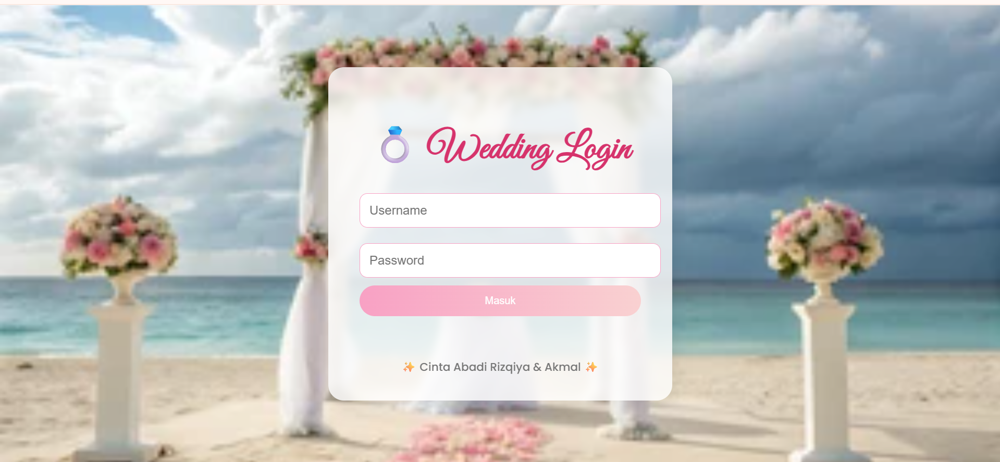
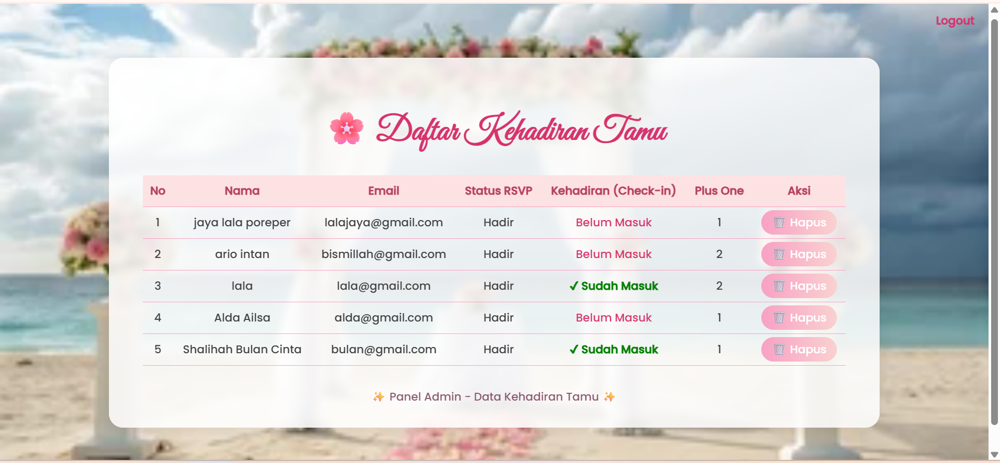
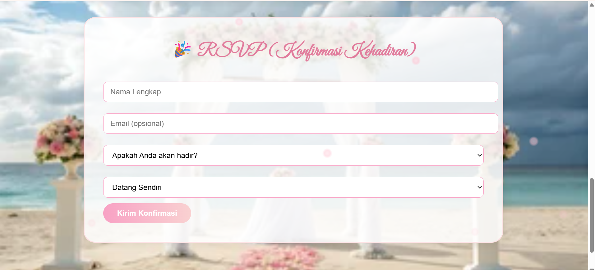

# 💒 Buku Tamu Digital (Wedding Guestbook)


Proyek ini adalah aplikasi **Buku Tamu Digital** berbasis web untuk keperluan acara pernikahan.  
Aplikasi ini dibuat menggunakan **PHP**, **MySQL**, dan **phpMyAdmin**.

---

## 📋 Fitur Utama

🔐 Login Page



🛠️ Admin Page



✅ Guest Attendance Confirmation Page



📱 Pager Page


---

## 🔑 Akun Login

| Role      | Username | Password   |
| --------- | -------- | ---------- |
| 👑 Admin  | `admin`  | `admin123` |
| 🪶 Pagers | `pager`  | `pager123` |

---

## ⚙️ Struktur Database

Tabel utama: `guests`

| Kolom          | Tipe Data                         | Keterangan                                |
| -------------- | --------------------------------- | ----------------------------------------- |
| id             | INT (Primary Key, AUTO_INCREMENT) | ID unik tamu                              |
| name           | VARCHAR(255)                      | Nama tamu                                 |
| email          | VARCHAR(255)                      | Email tamu                                |
| message        | TEXT                              | Pesan ucapan                              |
| created_at     | TIMESTAMP                         | Waktu pengisian                           |
| checkin_status | VARCHAR(50)                       | Status kehadiran (default: 'Belum Masuk') |

### Tambahkan kolom `checkin_status`

Jika sudah memiliki tabel `guests`, jalankan perintah SQL ini di phpMyAdmin:

```sql
ALTER TABLE guests ADD COLUMN checkin_status VARCHAR(50) DEFAULT 'Belum Masuk';
```

---

## 🚀 Cara Menjalankan

1. Pastikan sudah menginstal **XAMPP** .
2. Letakkan folder proyek ini di dalam folder `htdocs` (untuk XAMPP).
3. Jalankan **Apache** dan **MySQL** dari Control Panel.
4. Buka [http://localhost/phpmyadmin](http://localhost/phpmyadmin) dan buat database baru, misalnya `wedding_guest2`.
5. Impor file `guests.sql` ke database tersebut.
6. Akses aplikasi di browser:  
   👉 `http://localhost/nama-folder-proyek`
7. Login menggunakan akun di atas (admin atau pagers).

---
